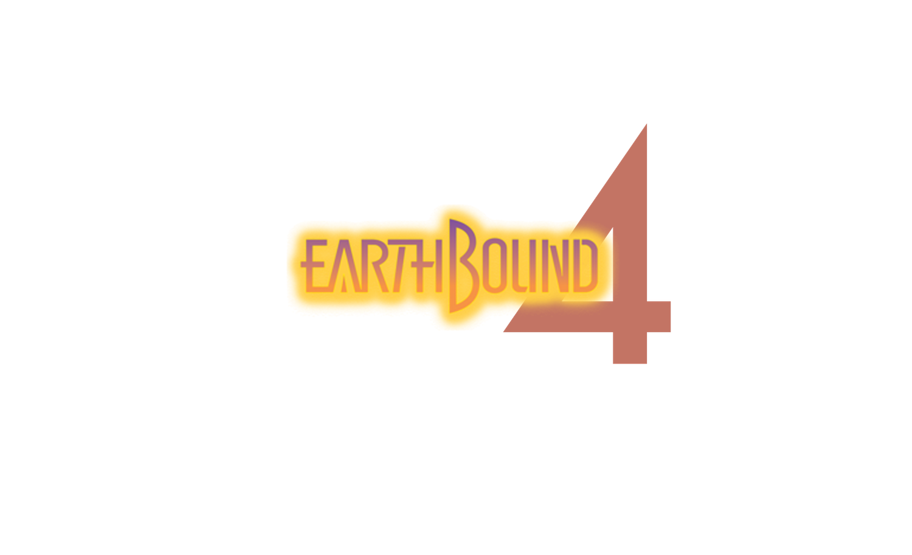

 
 
# Welcome to Earthbound 4!
Is this an assignment for SER316 at ASU Polytechnic Campus? **Maybe...** Is this another one of Pokey's evil ruses to rule the world once again? **Most definitly.** ✧ (▀̿Ĺ̯▀̿ ̿) 

Welcome to Onette, where our hero Ness lives to once again return to humanity's rescue. He and his many friends, including his trusty dog sidekick Randy, will be forced to battle villains at the hottest spots close and far from Onette. Villains, like 
Silberkugel and Bronze Kneecap, will try to overcome Ness and his friends' powers and aid Pokey to his conquest of planetary destruction.  (ﾉ◕ヮ◕)ﾉ*:･ﾟ✧ ᵖᵏ ˢᵗᵃʳˢᵗᵒʳᵐ✧ﾟ･

### Software Structure 
Following Design Patterns are used for the sturcture of this simulation: 
- Builder Design Pattern
- Decorator Design Pattern

The simulation begins in the city of Onette, where villains will "spawn" through the builder design pattern. These villains, inspired by both Nintendo's SNES release "EARTHBOUND" and my previous assignment for this class, will be randomly generated villains with different attacking power and health. 

More information covering villanous activity in Onette: 
- Villain layers will be constructed by the builder pattern
- Villains will belong to group layers where heroes will battle
- Villains will have randomly generated names and descriptions

Heroes and villains engage in battle, victory dependant on HP, strength, and special abilities. All heroes and villains will have powers and through a power multiplier will affect characters in different ways. 

I will continue to add to this read me as development progresses.  ヾ(⌐■_■)ノ♪

